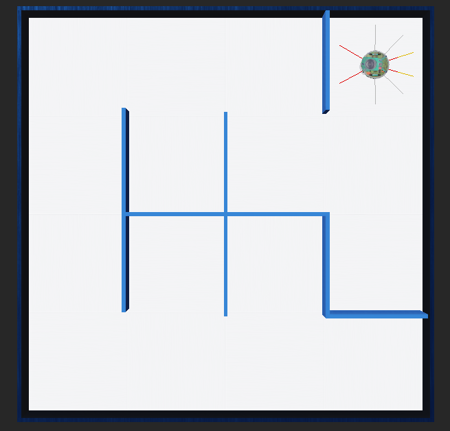

# Maze Solver with e‑Puck Robot in Webots

## 🚀 Project Overview
This repository demonstrates a maze-solving approach in a 4×4 environment using an e‑Puck robot simulated in Webots. The robot employs infrared proximity sensors to detect walls and applies a **Depth‑First Search (DFS)** algorithm with a **stack-based implementation** to navigate from the starting cell (ID 3) to the maze's center.

An alternative version using **Breadth-First Search (BFS)** can also be implemented for shortest-path exploration, but the current version focuses on DFS.

## 📸 Simulation Preview
You can find a screenshot of the simulation environment below:



📽️ A demonstration video showing the robot navigating the maze is available [here](./image_video/maze_1.mp4).

## 📋 Repository Structure
```
maze-solver-epuck/
├── controllers/
│   └── my_controller.py      # Robot controller implementation
├── worlds/
│   └── maze.wbt            # Maze world file for Webots
├── media/
│   ├── simulation_preview.png  # Screenshot of Webots environment
│   └── maze_solver_demo.mp4    # Video demo of robot in action
├── README.md               # This file
```

## 🔧 Prerequisites
- **Python 3.8+**
- **Webots 2023b** or later
- **Webots Python API** (included with Webots installation)

## 📥 Installation
```bash
# Clone the repository
git clone https://github.com/Seyed07/Maze-Solver-with-e-Puck-Robot-in-Webots
cd Maze-Solver-with-e-Puck-Robot-in-Webots
```
## ▶️ Running the Simulation
1. Launch Webots.
2. Open the world file: **File → Open World → worlds/maze.wbt**.
3. In the Robot Controller panel, select `my_controller.py`.
4. Press the ▶️ Run button to start the simulation.

## ⚙️ Sensor and Motor Configuration
```python
# Infrared proximity sensors: front, right, rear, left
psNames = ['ps0', 'ps7', 'ps3', 'ps4']
threshold = 80  # sensor reading above this indicates a wall

# Configure wheel motors for infinite rotation and zero speed initially
leftMotor.setPosition(float('inf'))
rightMotor.setPosition(float('inf'))
leftMotor.setVelocity(0)
rightMotor.setVelocity(0)
```

## 🧠 DFS Algorithm with Stack
This simulation uses an iterative **Depth‑First Search (DFS)** algorithm with an explicit **stack**:

1. **Node Representation**: Each maze cell is represented by a `node` object with:
   - `id`: Cell identifier
   - `dir`: Entry direction
   - `searched`: Boolean flag for visitation

2. **Stack Logic**:
```python
stack = []
stack.append(start_node)  # Push starting node (ID 3)

while stack:
    current = stack[-1]  # Peek top of stack
    if not current.searched:
        stack = search(current, stack, duration)  # Explore neighbors
    else:
        stack.pop()  # Backtrack if fully searched
```

3. **Search Functionality**: The `search()` function does the following:
   - Uses sensor data to determine wall presence
   - Prioritizes directions: right → forward → left
   - Pushes reachable, unvisited neighbors onto the stack
   - Backtracks (pops) when no paths are available

## 🔁 Recursive DFS Sample (Alternative)
```python
visited = set()

def dfs_recursive(node):
    visited.add(node)
    if node == goal:
        return True
    for direction in ['right', 'forward', 'left']:
        if is_free(direction):
            nxt = move(direction)
            if nxt not in visited and dfs_recursive(nxt):
                return True
            backtrack()
    return False

# Start search
dfs_recursive(start_node)
```

## ⚠️ Known Issues
- **Return Path Accuracy**: The robot might slightly misalign when returning due to `delay()` timing inconsistencies.
- **Manual Delay Calibration**: Rotation delays may require manual fine-tuning for accurate navigation.

## 🤝 Contributing
Contributions are welcome! You can help by:
- Implementing BFS or other search strategies
- Enhancing movement precision
- Refactoring code or improving modularity
- Adding UI overlays for real-time robot state


---
*For questions or feedback, please raise an issue or reach out via email.*

